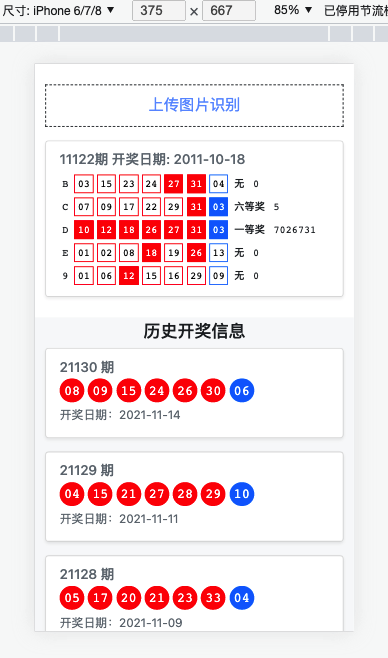

# dream-lottery

### spider_data/ssq.txt 数据字段格式,按逗号分割后顺序为   
|  期号  | 红球1 | 红球2 | 红球3 | 红球4 | 红球5 | 红球6 | 篮球 | 一等奖 | 二等奖 | 开奖日期 |
|  ----  | ----  | ----  | ----  | ----  | ----  | ----  | ----  | ----  | ----  | ----  |
21125 | 14 | 19 | 20 | 23 | 24 | 31 | 09 | 8898474 | 232052 | 2021-11-02
21124 | 01 | 03 | 18 | 22 | 29 | 32 | 02 | 7956250 | 252670 | 2021-10-31


### dream-lottery-web
dream-lottery-web 是一个spring boot web服务，拥有查询最新开奖信息和拍照识别中奖功能
页面地址：http://127.0.0.1:8080/ssq/index

OCR图片文字识别集成的百度OCR SDK，百度的OCR个人认证可以领取每个月1000次的免费查询，需要使用到OCR功能需要传入以下3个参数
BAIDU_OCR_APPID="111"
BAIDU_OCR_APPKEY="222"
BAIDU_OCR_SECRET="333"

```
docker 快速启动

docker run --restart=always --name dream-lottery-web -p 8080:8080 -e BAIDU_OCR_APPID="111" -e BAIDU_OCR_APPKEY="222" -e BAIDU_OCR_SECRET="333" midaug/dream-lottery-web:latest
```

#### 效果图
